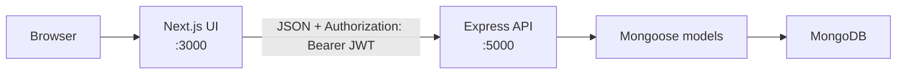
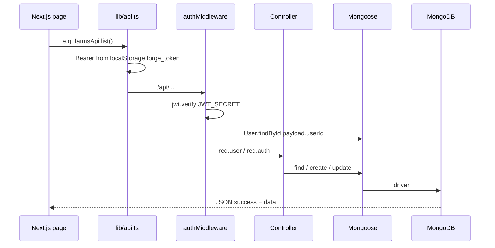
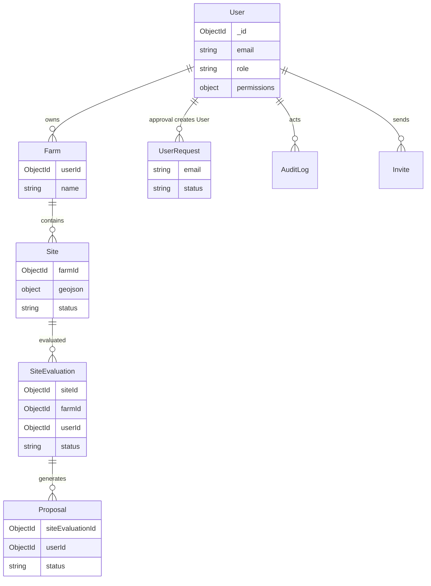
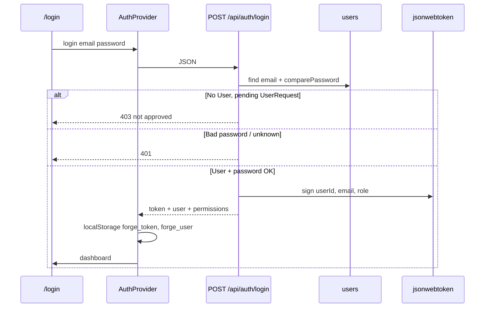
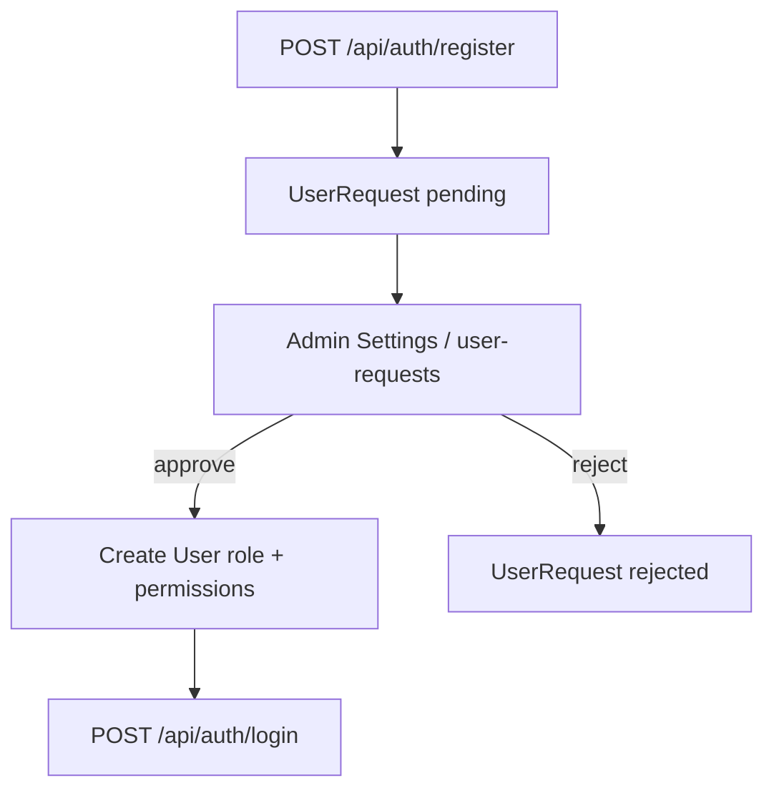
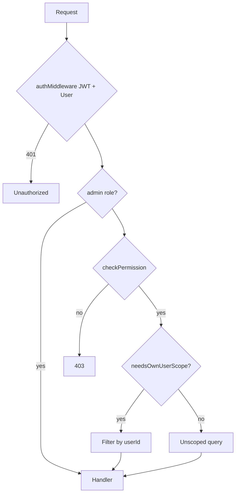

# Growteq Forge — Architecture

This document describes the **current** system: Next.js UI, Express API, MongoDB via **Mongoose**, JWT auth, and RBAC.

**Prisma is not used at runtime.** Leftover generated files live under `backend/src/generated/prisma/`. The API does not import Prisma. Persistence is **Mongoose** in `backend/src/models/`.

---

## 1. System design

Two Node processes, one database:

| Process | Role | Default |
|---------|------|---------|
| Next.js 14 (App Router) | UI, client auth state, Axios → API | Port **3000** |
| Express (`backend/src/server.ts`) | REST, JWT, RBAC, PDFs | Port **5000** (`PORT`) |
| MongoDB | Documents | `MONGODB_URI` |

Next.js never opens MongoDB. The browser calls Express. Express uses Mongoose. Mongoose talks to MongoDB.



CORS allows `FRONTEND_URL`, `FRONTEND_ORIGIN`, and `http://localhost:3000` (`credentials: true`).

Health: `GET /health` on the API. The UI pings it on load (`app/providers.tsx`) so a cold host can wake up.

---

## 2. Next.js ↔ Mongoose ↔ MongoDB

There is **no Prisma client** and no Next.js server action that writes to the database. The contract is HTTP.



**Frontend (`lib/api.ts`):** Axios `baseURL` = `NEXT_PUBLIC_API_URL` (fallback `http://localhost:5000`). Request interceptor sets `Authorization: Bearer <token>`. On **401** (except login), it clears `forge_token` / `forge_user` and sends the user to `/login`.

**Backend:** `connectDb()` in `backend/src/config/db.ts` runs `mongoose.connect(MONGODB_URI)` before `listen`. Missing `MONGODB_URI` or `JWT_SECRET` → process **exits**.

Typical JSON: `{ success: true, data }` or `{ success: false, error }`.

---

## 3. Runtime layout

```
growteq-forge/
├── app/                              # Next.js App Router
│   ├── login, register, invite/[token], logout
│   ├── context/auth-context.tsx
│   ├── providers.tsx                # AuthProvider + GET /health
│   └── dashboard/
│       ├── layout.tsx               # Shell; wraps ProtectedLayout
│       └── ProtectedLayout.tsx
├── lib/api.ts
├── lib/permissions.ts                 # Client RBAC (keep in sync with backend)
├── components/dashboard/dashboard-page-guard.tsx
└── backend/src/
    ├── server.ts
    ├── config/db.ts, env.ts
    ├── models/
    ├── routes/, controllers/, middleware/, services/
    └── scripts/ensureAdminUser.ts
```

### API mounts (`server.ts`)

| Prefix | Area |
|--------|------|
| `/api/auth` | Register (pending), login, `GET /me` |
| `/api/farms`, `/api/sites`, `/api/site-evaluations` | Farms, maps, evaluations |
| `/api/proposals`, `/api/notifications` | Proposals, notifications |
| `/api/dashboard`, `/api/insights`, `/api/finance`, `/api/cost` | Aggregates, costing |
| `/api/reports`, `/api/maps` | PDFs, map helpers |
| `/api/settings` | Team + infrastructure config |
| `/api/audit` | Audit log |
| `/api/invite`, `/api/user-requests` | Invites, registration approval |

Protected routes use `authMiddleware`. Farm **delete** also requires **admin** (`authorizeRoles("admin")` in `backend/src/routes/farms.ts`).

---

## 4. Data model (MongoDB + Mongoose)

Relations are **ObjectId refs**, not Prisma relations.



| Model | Role |
|-------|------|
| `User` | Login identity, `role`, optional per-module `permissions` |
| `UserRequest` | Pending / approved / rejected self-registration |
| `Farm` / `Site` | Geography; site `geojson`, area, perimeter |
| `SiteEvaluation` | Soil/water/slope, infra snapshot, investment |
| `Proposal` | Tied to evaluation; draft / sent / recommended / rejected |
| `Notification` | In-app notifications |
| `AuditLog` | Security-relevant actions |
| `Invite` | Invite token, role, permissions |
| `Infrastructure` / `InfraConfigMeta` | Shared infra cost/ROI config |

Users **without write** on a module are often limited to **their own** rows (`needsOwnUserScope` in `backend/src/utils/permissionUtils.ts`). Admins are not scoped.

---

## 5. Auth flow (JWT)

Login is **not** admin-only. **Any approved `User`** with a valid password receives a JWT. **Admin** is a role on that user. Self-registration does **not** create a `User` until an admin approves the `UserRequest`.

### Login



**Token:** HMAC JWT (`JWT_SECRET`), expiry `JWT_EXPIRES_IN` (default `7d`). Payload: `{ userId, email, role }`. Issued by `signToken` in `backend/src/services/tokenService.ts`.

**Browser:** `localStorage` keys `forge_token` and `forge_user`. `ProtectedLayout` redirects to `/login` if the token is missing or `isAuthenticated` is false. After a stored token is found, `GET /api/auth/me` refreshes the user (including effective permissions).

**API:** `authMiddleware` reads `Authorization: Bearer`, `jwt.verify`s, loads `User` by `userId`, sets `req.user` / `req.auth`. Invalid token → 401.

Passwords: **bcrypt** on `User` and `UserRequest` (password fields `select: false`).

### Registration (admin gate)



Until a `User` exists, a matching pending request on login returns **403**. Recovery: `backend/src/scripts/ensureAdminUser.ts` (does not wipe farms).

Optional **invites** (`/api/invite`, `/invite/[token]`) can create a user with role/permissions from the invite.

---

## 6. RBAC

Two layers, both enforced:

1. **Role** — canonical `admin` | `editor` | `viewer` on `User.role`. Legacy values (`field_evaluator`, `sales_associate`, `user`, UI labels) map via `normalizeRole`.
2. **Module permissions** — `{ read, write }` per module: `farms`, `sites`, `evaluations`, `proposals`, `reports`, `finance`, `settings`.

**Admins** always pass `checkPermission`. For others, stored `user.permissions` **patches** role defaults (`getEffectivePermissions`). Login and `/me` return that merged map so the UI can match the API.

### Defaults when `permissions` is omitted

| Module | admin | editor | viewer |
|--------|-------|--------|--------|
| farms, sites, evaluations, proposals | read+write | read+write | read |
| reports | read+write | read | read |
| finance | read+write | none | none |
| settings | read+write | none | none |

### Enforcement

| Layer | Mechanism |
|-------|-----------|
| API | `checkPermission(module, "read" \| "write")` after `authMiddleware` |
| API | `authorizeRoles("admin")` for some deletes (e.g. farm) |
| UI | Sidebar via `canReadModule` |
| UI | `DashboardPageGuard` |
| UI | Actions via `canWriteModule` / `hasPermission` |

Keep **`lib/permissions.ts`** defaults aligned with **`backend/src/utils/permissionUtils.ts`**.



---

## 7. Frontend (protected)

`app/page.tsx` redirects to `/dashboard/overview`. `app/dashboard/layout.tsx` wraps children in `ProtectedLayout`.

Areas: Overview, Dashboard (WIP), Farms (Leaflet), Crops, Evaluations, Finance, Reports, Insights, Settings (team + infra; needs settings **read**).

Maps: Leaflet on farms. Optional `NEXT_PUBLIC_MAPBOX_TOKEN` for satellite tiles. PDFs may use backend `MAPBOX_TOKEN`.

---

## 8. Cross-cutting

- **Audit:** `logAudit` writes login, registration requests, approvals, and other security events (`AuditLog`). Failures are logged, not thrown on the hot path.
- **Errors:** `asyncHandler` + `errorHandler`. Malformed JSON → **400**.
- **PDF / images:** jsPDF, pdfkit, sharp (logo rasterization on API start).
- **Email:** SMTP optional; if `SMTP_HOST` is unset, invite links go to the console.

---

## 9. Files to read first

| Topic | Files |
|-------|--------|
| Mount + CORS | `backend/src/server.ts` |
| Mongo | `backend/src/config/db.ts` |
| JWT | `backend/src/services/tokenService.ts`, `backend/src/middleware/auth.ts` |
| Login / register | `backend/src/controllers/authController.ts` |
| RBAC | `backend/src/utils/permissionUtils.ts`, `backend/src/middleware/permissionMiddleware.ts` |
| Client HTTP | `lib/api.ts` |
| Client session | `app/context/auth-context.tsx`, `app/dashboard/ProtectedLayout.tsx` |
| Client RBAC | `lib/permissions.ts` |

---

## 10. What this is not

- **Not** Prisma / Postgres. Do not treat `DATABASE_URL` or `prisma migrate` as live.
- **Not** Next.js Route Handlers as the system of record. Browser `/api/*` calls go to Express via `NEXT_PUBLIC_API_URL`.
- **Not** cookie-session auth. The browser stores a **JWT** in `localStorage`.
